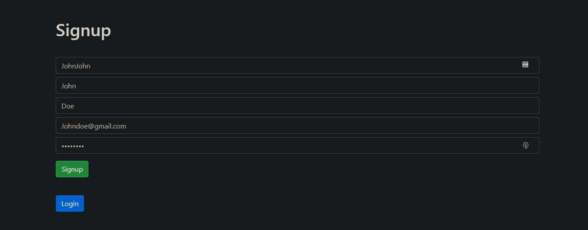
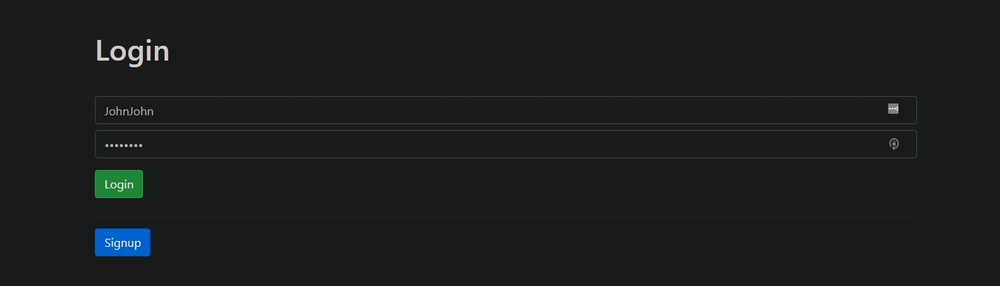
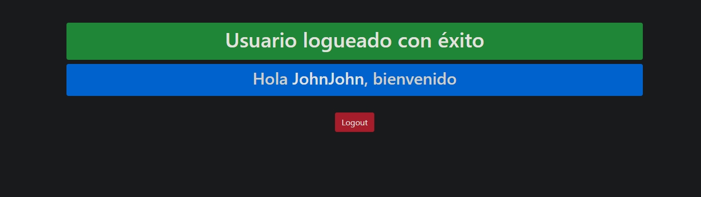

# Desafío 13 

* En esta entrega he utilizado **passport-local** y **mongoose** para crear vistas de Registro y Logueo de un usuario. Los datos se almacenan en **Mongo Atlas**.

## Tecnologías usadas

* Express.js
* Handlebars.js
* Mongoose
* Passport

## Preview

* Signup

* Login

* Main

* Failed login & signup

